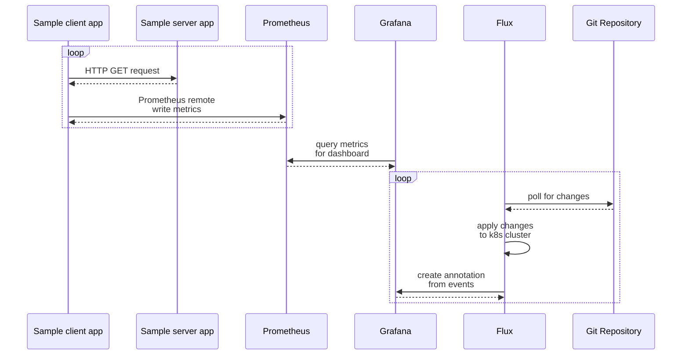

# Walkthrough of Grafana Annotations for Flux Events

This is a sample showing how to setup automated Grafana Annotations from Flux Events, including instructions for setting up a local demo environment.

## Purpose

Grafana annotations allow users to add crucial context to their dashboards. By marking significant events directly on the dashboard, users can easily compare these events with observed trend changes. This feature can significantly reduce troubleshooting time, as it enables users to correlate events with multiple trends simultaneously.

This is particularly valuable in continuous integration and deployment scenarios, where changes occur automatically and frequently. For instance, annotating an application deployment on a dashboard can help users quickly determine whether observed trend changes are likely related to that specific deployment.

In this walkthrough, we use Flux as an example to demonstrate this functionality.

## Setup

A devcontainer is included, configured with the tools required to follow this sample. To follow along without the devcontainer, install the tools listed below.

- Docker - <https://docs.docker.com/get-docker/>
- k3d - <https://k3d.io/#installation>
- kubectl - <https://kubernetes.io/docs/tasks/tools/#kubectl>

The walkthrough requires a git push to trigger Flux events. Fork the repository and update  the `url` field in `flux-init/gotk-repo.yaml`.

```yaml
apiVersion: source.toolkit.fluxcd.io/v1
kind: GitRepository
...
  # change this to your fork
  url: https://github.com/AAkindele/grafana-gitops-annotations.git
```

## Walkthrough



For this walkthrough, we are using a local k3d Kubernetes cluster set up with Prometheus, Grafana, and two sample applications. These applications are primarily used to generate metrics for our Grafana dashboard. Flux will be responsible for deploying application changes to the cluster.

The purpose of this setup is to simulate a standard development lifecycle that can benefit from automated annotations. During the walkthrough, we'll modify the application deployment through Flux and observe the Grafana dashboard for any changes in the monitored signals.

### Create Local K8s Cluster

### Build and Push Sample App

### Deploy Prometheus Operator

### Setup Flux for GitOps

### Setup Flux to Deploy Sample Apps

TODO: describe the different components that are needed for this to work
- flux notification alert
- flux notification provider
- grafana dashboard annotation configuration with screenshots

### Create Secret for Grafana Service Account Token

TODO: describe process and include screenshots

### Trigger a Flux Event

TODO: include before and after screenshots

```bash

# create cluster
k3d cluster create --config k3d.yaml

# deploy prometheus operator
kubectl create -f https://raw.githubusercontent.com/prometheus-operator/prometheus-operator/v0.74.0/bundle.yaml

# build sample app
docker build \
  --file ./grafana-k6/Dockerfile \
  --tag k3d-registry.localhost:5000/k6-app \
  ./grafana-k6/

# push image
docker push k3d-registry.localhost:5000/k6-app

# deploy flux
kubectl apply -f flux-init/gotk-components.yaml
kubectl apply -f flux-init/gotk-repo.yaml
kubectl apply -f flux-init/gotk-sync.yaml

# deploy applications
kubectl apply -f deploy/flux-kustomization.yaml

# wait till pods are up and running
kubectl get pods -a

# connect to grafana
kubectl port-forward service/grafana 3000:3000

# Go to http://localhost:3000 in browser

# create Service Account API token in Grafana UI with "Editor" role
# https://grafana.com/docs/grafana/latest/administration/service-accounts/

# set token variable
TOKEN=<service account api token>

# create k8s secret for the token
kubectl create secret generic grafana-token \
  --from-literal token="${TOKEN}"

```

## Clean Up

Delete the local Kubernetes cluster to clean up.

```bash

k3d cluster delete --config k3d.yaml

```

## References

- Flux documentation for Grafana Annotations: <https://fluxcd.io/flux/monitoring/alerts/#grafana-annotations>
- Flux Grafana Notitication Provider: <https://fluxcd.io/flux/components/notification/providers/#grafana>
- Grafana Annotations API: <https://grafana.com/docs/grafana/latest/developers/http_api/annotations/>
