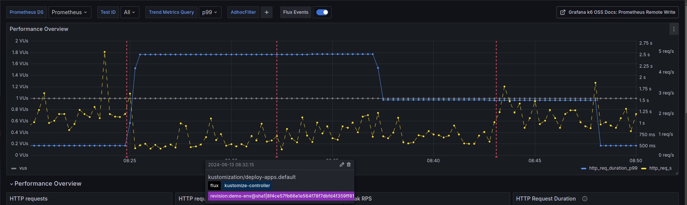

# Walkthrough of Grafana Annotations for Flux Events

This is a sample showing how to setup automated Grafana Annotations from Flux Events, including instructions for setting up a local demo environment.

## Purpose

Grafana annotations allow users to add crucial context to their dashboards. By marking significant events directly on the dashboard, users can easily compare these events with observed trend changes. This feature can significantly reduce troubleshooting time, as it enables users to correlate events with multiple trends simultaneously.

This is particularly valuable in continuous integration and deployment scenarios, where changes occur automatically and frequently. For instance, annotating an application deployment on a dashboard can help users quickly determine whether observed trend changes are likely related to that specific deployment.

In this walkthrough, we use Flux as an example to demonstrate this functionality.

## Setup

A devcontainer is included, configured with the tools required to follow this sample. To follow along without the devcontainer, install the tools listed below.

- Docker - <https://docs.docker.com/get-docker/>
- k3d - <https://k3d.io/#installation>
- kubectl - <https://kubernetes.io/docs/tasks/tools/#kubectl>

The walkthrough requires a git push to trigger Flux events. Fork the repository and update  the `url` field in `flux-init/gotk-repo.yaml`. If you're using a different branch other than `main`, update the `branch` field to match.

```yaml
apiVersion: source.toolkit.fluxcd.io/v1
kind: GitRepository
...
  ref:
    # change this to your branch if using something other than main
    branch: main
  # change this to your fork
  url: https://github.com/AAkindele/grafana-gitops-annotations.git
```

## Walkthrough


For this walkthrough, we are using a local k3d Kubernetes cluster set up with Prometheus, Grafana, and two sample applications. These applications are primarily used to generate metrics for our Grafana dashboard. Flux will be responsible for deploying application changes to the cluster.

The purpose of this setup is to simulate a standard development lifecycle that can benefit from automated annotations. During the walkthrough, we'll modify the application deployment through Flux and observe the Grafana dashboard for any changes in the monitored signals.

### Create Local K8s Cluster

Create a K3d Kubernetes cluster along with local container registry.

```bash
k3d cluster create --config k3d.yaml
```

### Build and Push Sample Application

This sample application is a Grafana K6 instance running a simple script. It is easy to configure and allows us to generate metrics for the Grafana dashboard we'll use later for annotations.

```bash
# build sample app
docker build \
  --file ./grafana-k6/Dockerfile \
  --tag k3d-registry.localhost:5000/k6-app \
  ./grafana-k6/

# push image
docker push k3d-registry.localhost:5000/k6-app
```

### Deploy Prometheus Operator

The Prometheus Operator manages the deployment of Prometheus.

```bash
kubectl create -f https://raw.githubusercontent.com/prometheus-operator/prometheus-operator/v0.74.0/bundle.yaml
```

### Setup Flux for GitOps

Remember to update the `url` and `branch` fields in `flux-init/gotk-repo.yaml` to your fork and branch. We'll push changes to the sample application later in the walkthrough for Flux to deploy.

```bash
kubectl apply -f flux-init/gotk-components.yaml
kubectl apply -f flux-init/gotk-repo.yaml
kubectl apply -f flux-init/gotk-sync.yaml
```

### Setup Flux to Deploy Sample Applications

Apply the Kustomization for deploying the rest of the applications to the cluster. Flux will handle the rest.

```bash
kubectl apply -f deploy/flux-kustomization.yaml
```

### How Automated Annotations are Configured

Most of the requirements to setup automated Grafana annotations are deployed by the applied kustomization above.

First is a notification provider.
> The Provider API defines how events are encoded and where to send them.

<https://fluxcd.io/flux/components/notification/providers/>

In this walkthrough environment, we use the Grafana provider to send notifications to the Grafana instance running in the cluster.

```yaml
# snippet of deploy/flux-notifications/alert.yaml
spec:
  type: grafana
  address: http://grafana.default:3000/api/annotations
```

Second is a notification alert.
>The Alert API defines how events are filtered by severity and involved object, and what provider to use for dispatching.

<https://fluxcd.io/flux/components/notification/alerts/>

For the walkthrough, we're interested in the events related to application deployments. Kustomization events are one of the types that fit that requirement.

```yaml
# snippet of deploy/flux-notifications/alert.yaml
spec:
  eventSeverity: info
  eventSources:
  - kind: Kustomization
    name: '*'
    namespace: default
```

Third is the Grafana dashboard with annotations enabled, which is also deployed with Flux in `deploy/grafana/grafana-config.yaml`.

There is a toggle for displaying the Flux events.


For the annotations setting, the data source is set to Grafana.


For this specific annotation, filter by annotations tagged with `flux`, which is automatically added by the Flux Grafana provider we setup earlier.


### Verify Environment

Wait till pods are up and running.

```bash
kubectl get pods -A
```

Example output:

```bash
NAMESPACE     NAME                                       READY   STATUS    RESTARTS   AGE
kube-system   local-path-provisioner-6c86858495-svfhl    1/1     Running   0          2m32s
kube-system   coredns-6799fbcd5-m2q92                    1/1     Running   0          2m32s
kube-system   metrics-server-54fd9b65b-7tcqr             1/1     Running   0          2m32s
default       prometheus-operator-69cbc6f76c-sxdln       1/1     Running   0          117s
flux-system   source-controller-86b8b57796-z7xrp         1/1     Running   0          108s
flux-system   helm-controller-5f7457c9dd-959rh           1/1     Running   0          107s
flux-system   kustomize-controller-5f58d55f76-qvh89      1/1     Running   0          108s
flux-system   notification-controller-685bdc466d-4sdd7   1/1     Running   0          106s
default       grafana-k6-697698687d-gsgwl                1/1     Running   0          82s
default       go-httpbin-6c9cf5c8b9-6mq75                1/1     Running   0          84s
default       prometheus-prometheus-0                    2/2     Running   0          81s
default       grafana-5d457b4996-lwl6m                   1/1     Running   0          83s
```

Connect to the Grafana instance by port forwarding to the Kubernetes Service port for Grafana.

```bash
kubectl port-forward service/grafana 3000:3000
```

Go to <http://localhost:3000> in browser and login to Grafana. The default username and password is `admin`.

<https://grafana.com/docs/grafana/latest/setup-grafana/sign-in-to-grafana/#steps>

### Create Secret for Grafana Service Account Token

To complete the process, Flux needs a token to authenticate with the Grafana API when creating annotations from the Flux events we've configured.

Create a Service Account with the `Editor` role and create a token as well, <https://grafana.com/docs/grafana/latest/administration/service-accounts/>.

Go to <http://localhost:3000/org/serviceaccounts/create> in your browser to create the service account.

Then create a token using the `Add service account token` button.

```bash
# create Service Account API token in Grafana UI with "Editor" role
# https://grafana.com/docs/grafana/latest/administration/service-accounts/

# set token variable
TOKEN=<service account api token>

# create k8s secret for the token
kubectl create secret generic grafana-token \
  --from-literal token="${TOKEN}"
```

### Trigger a Flux Event

With everything setup, trigger a new application deployment by updating the yaml deployment file, `deploy/app/grafana-k6.yaml`. Update the `MAX_DELAY` value to 5 to increase the maximum delay in seconds that the sample application will add to all requests.

```yaml
- name: "MAX_DELAY"
  # change this value from the default 1 to 5
  value: "1"
```

Commit the changes to git and push. After a minute or two, the changes will be deployed to the cluster.

To force immediate changes, use the Flux CLI to reconcile the new changes.

```bash
flux reconcile source git grafana-gitops-annotations
flux reconcile kustomization deploy-apps -n default
```

View the results in the `k6 Prometheus` Grafana dashboard at <http://localhost:3000/dashboards>.

Without annotations, it is clean something changes with the application's behavior, but the reason is not immediately obvious.


With the Flux Events annotation enable, the dashboard now shows when Flux made changes to the application. This provides valuable context to help with troubleshooting potential anomalies.



## Clean Up

Delete the local Kubernetes cluster to clean up.

```bash
k3d cluster delete --config k3d.yaml
```

## References

- Flux documentation for Grafana Annotations: <https://fluxcd.io/flux/monitoring/alerts/#grafana-annotations>
- Flux Grafana Notification Provider: <https://fluxcd.io/flux/components/notification/providers/#grafana>
- Grafana Annotations API: <https://grafana.com/docs/grafana/latest/developers/http_api/annotations/>
